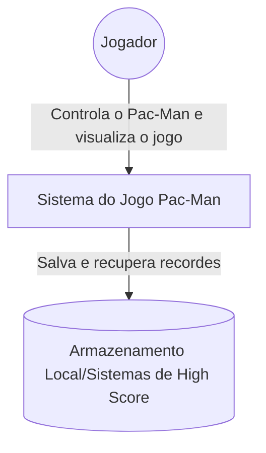
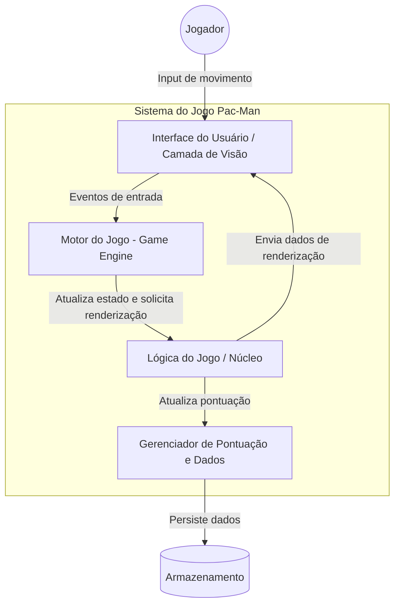
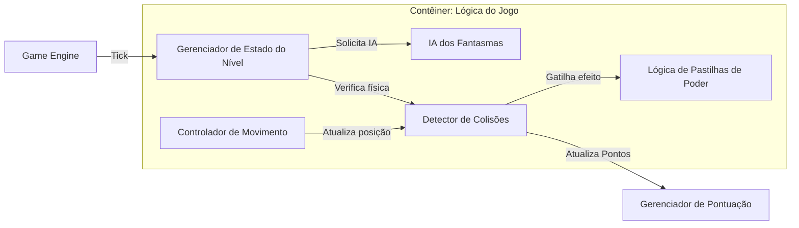

# Modelo C4: Arquitetura do Jogo Pac-Man

Este documento descreve a arquitetura do sistema de software para o clássico jogo Pac-Man, utilizando os três primeiros níveis do Modelo C4.

## 1. Nível de Contexto (Nível 1)

O foco deste nível é mostrar como o sistema de software se encaixa no mundo ao seu redor, identificando os usuários e sistemas externos.

### Diagrama de Contexto

### Descrição

*   **Usuário (Jogador):** O ser humano que interage com o jogo através de periféricos (teclado, joystick ou touch). O objetivo é coletar todos os pontos no labirinto enquanto evita os fantasmas.
*   **Sistema do Jogo Pac-Man:** O software central que processa a lógica, renderiza os gráficos e gerencia o estado da partida.
*   **Sistemas Externos (Armazenamento):** Pode ser um sistema de arquivos local ou uma API externa para persistência de recordes (High Scores).

## 2. Nível de Contêineres (Nível 2)

O nível de contêineres detalha as grandes unidades tecnológicas que compõem o sistema.

### Diagrama de Contêineres

### Responsabilidades

*   **Interface do Usuário (UI):** Responsável por exibir o labirinto, personagens, animações e o HUD (pontuação e vidas). Captura os comandos do jogador.
*   **Motor do Jogo (Engine):** Gerencia o Game Loop (ciclo de atualização). Coordena a temporização entre a física e a renderização.
*   **Lógica do Jogo (Núcleo):** Contém as regras: o que acontece quando o Pac-Man come uma pastilha de poder, como os fantasmas se movem e detecção de vitória/derrota.
*   **Gerenciador de Pontuação:** Trata da persistência dos dados e lógica de ranking.

## 3. Nível de Componentes (Nível 3)

Este nível detalha os elementos funcionais dentro de um contêiner específico. Focaremos no contêiner de Lógica do Jogo.

### Diagrama de Componentes (Contêiner: Lógica do Jogo)

### Descrição dos Componentes

*   **Controlador de Movimento:** Valida se a direção desejada pelo jogador é possível dentro do mapa (paredes).
*   **IA dos Fantasmas:** Implementa os comportamentos distintos para cada fantasma (Blinky, Pinky, Inky e Clyde), alternando entre estados de "Perseguição", "Dispersão" e "Assustado".
*   **Detector de Colisões:** Identifica interações entre o Pac-Man e as paredes, pontos, pastilhas de poder ou fantasmas.
*   **Gerenciador de Estado do Nível:** Controla a transição entre fases, reset de posições após morte e o status atual da partida (Iniciando, Jogando, Pausado, Game Over).
*   **Lógica de Pastilhas de Poder:** Gerencia o tempo de vulnerabilidade dos fantasmas e a mudança de comportamento global quando uma pastilha grande é consumida.

## Objetivos e Limitações

*   **Objetivo:** Proporcionar uma experiência de jogo fluida com 60 FPS estáveis, garantindo que a IA dos fantasmas replique fielmente o comportamento do arcade original.
*   **Limitações:** O sistema deve lidar com latência de entrada mínima e garantir que a detecção de colisão seja precisa para evitar que personagens atravessem paredes ou ignorem itens.
