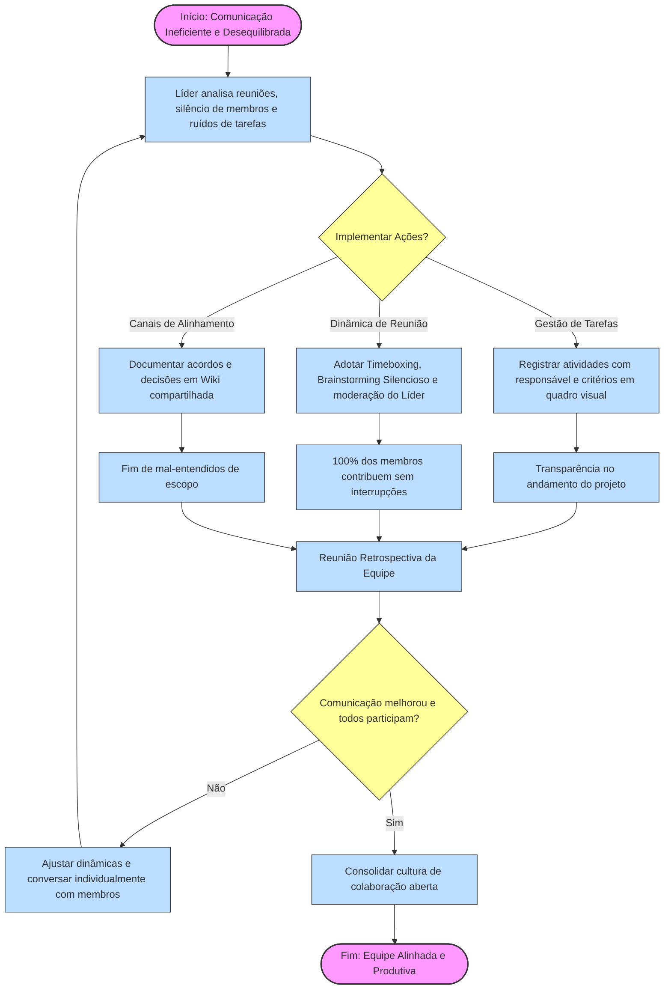

# Análise de Comunicação e Dinâmica de Equipe: Estudo de Caso

Este documento apresenta uma análise detalhada sobre a dinâmica de comunicação de uma equipe de cinco pessoas, identificando seus principais gargalos e propondo soluções práticas e metodológicas para promover a equidade, clareza e colaboração no ambiente de trabalho.

---

## 1. Introdução

A comunicação assertiva é a espinha dorsal de qualquer projeto de engenharia ou desenvolvimento de software de alta performance. Quando os canais de diálogo falham ou tornam-se centralizados, o projeto sofre um efeito cascata de desalinhamento: requisitos não compreendidos geram retrabalho, o silêncio de membros da equipe oculta boas ideias e riscos operacionais, e a liderança perde a visibilidade do progresso real. O presente estudo de caso analisa uma equipe de cinco pessoas que enfrenta exatamente esses sintomas de ineficiência, ruídos de comunicação e assimetria na participação, propondo estratégias estruturadas para transformar essa realidade.

---

## 2. Respostas às Perguntas do Caso

### 1) Quais são os principais problemas de comunicação nesta equipe?

Identifica-se uma combinação de fatores estruturais e comportamentais que prejudicam a eficiência do grupo:
* **Desequilíbrio de Participação (Assimetria):** A divisão clara entre membros dominantes (que monopolizam a palavra) e membros silenciosos (que se omitem) impede a inteligência coletiva da equipe de emergir.
* **Falta de Segurança Psicológica:** O silêncio prolongado de alguns membros geralmente indica o receio de serem julgados, interrompidos ou invalidados pelos colegas mais dominantes.
* **Inexistência de Mediação nas Reuniões:** A ausência de regras de moderação permite que o tempo e o foco das reuniões se percam em discussões unilaterais.
* **Falta de Clareza nas Atribuições:** Ruídos na comunicação direta resultam em mal-entendidos sobre "quem faz o quê", gerando gargalos, conflitos de escopo e atrasos nas entregas.

### 2) Que estratégias ou ferramentas você sugeriria para melhorar a comunicação?

Para reverter o cenário atual, sugere-se a adoção combinada de dinâmicas de facilitação e ferramentas digitais:

#### Dinâmicas de Facilitação
* **Técnica de *Timeboxing* e Rodadas (*Rounds*):** Estabelecer um tempo fixo (ex: 2 a 3 minutos) para que cada membro do grupo fale em reuniões de decisão, garantindo que todos tenham o espaço de fala sem interrupções.
* **Brainstorming Silencioso (*Brainwriting*):** Antes de abrir a discussão verbal, a equipe registra suas ideias individualmente e de forma silenciosa em post-its digitais ou papel. Isso remove a influência dos perfis dominantes sobre o pensamento dos demais.
* **Check-in e Check-out:** Iniciar e encerrar reuniões com uma breve rodada de compartilhamento de status pessoal/técnico para sintonizar a equipe.

#### Ferramentas Digitais
* **Quadros de Tarefas Visuais (Jira, Trello ou Azure Boards):** Para mitigar a falta de clareza nas tarefas, todas as atividades devem ser descritas com critérios de aceitação claros, prazos e responsáveis explícitos, eliminando a dependência apenas da comunicação verbal.
* **Mural Virtual (Miro ou Mural):** Ferramenta visual para facilitação gráfica que ajuda membros introvertidos a exporem ideias visualmente em tempo real.
* **Wiki e Documentação de Reuniões (Notion ou Wiki do Git):** Registros concisos das decisões tomadas e planos de ação (*Action Items*) compartilhados logo após cada encontro.

### 3) Como os membros da equipe poderiam promover uma cultura de comunicação aberta e equitativa?

A mudança de cultura parte da coresponsabilização de todos os integrantes:
* **Acordos de Convivência da Equipe:** Co-criar regras fundamentais de respeito, como "escutar sem planejar a resposta", "não interromper" e "valorizar divergências de opinião".
* **Empatia e Escuta Ativa:** Os membros dominantes devem exercitar a autodisciplina e abrir espaço fazendo perguntas direcionadas (ex: *"Gostaria muito de ouvir a opinião de fulano sobre isso"*).
* **Feedback Construtivo e Retrospectivas:** Realizar reuniões periódicas de melhoria de processo (como a Retrospectiva do Scrum) dedicadas especificamente a avaliar a dinâmica de trabalho e o clima da equipe, permitindo ajustes antes que os conflitos se consolidem.

### 4) Que papel o líder da equipe deve desempenhar na melhoria da comunicação?

O líder deve deixar de ser um mero emissor de ordens para assumir a postura de **facilitador e guardião do processo**:
* **Moderação Ativa:** O líder deve intervir educadamente quando um membro dominante se alongar demais e convidar ativamente os membros mais silenciosos a contribuírem (*"Fulano, você que tem bastante contexto dessa área, o que acha?"*).
* **Definição de Responsáveis:** Garantir que nenhuma reunião termine sem uma ata simples resumindo decisões, prazos e os responsáveis por cada entrega.
* **Criação de Segurança Psicológica:** Estimular um ambiente onde perguntas "simples" e erros honestos sejam encarados como aprendizado rápido, e não como fragilidade, desarmando barreiras de comunicação.

---

## 3. Fluxograma Lógico de Melhoria Contínua

O diagrama abaixo detalha o fluxo de ações contínuas para identificar, corrigir e manter uma comunicação eficiente e equitativa na equipe:

---

## 4. Conclusão

A ineficiência comunicativa em uma equipe pequena é um risco invisível que frequentemente desarranja cronogramas e corrói o clima organizacional. Conforme demonstrado nesta análise, a resolução desse problema não exige apenas novas ferramentas tecnológicas, mas sim uma mudança de comportamento focada na facilitação ativa e na construção de um espaço seguro onde todas as vozes sejam ouvidas. Ao descentralizar o debate, documentar decisões visualmente e estabelecer a liderança como um papel moderador, a equipe não apenas elimina os mal-entendidos de tarefas, mas maximiza o potencial analítico de cada um dos seus cinco membros, transformando a colaboração em uma alavanca para o sucesso do projeto.
