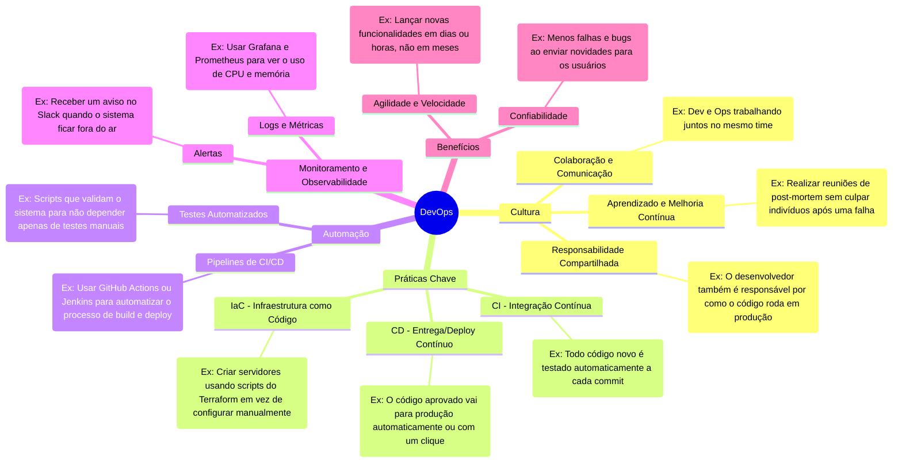

# Mapa Mental: Principais Conceitos de DevOps

Abaixo está o mapa mental visualizando os conceitos fundamentais do DevOps. Ele foi criado usando a sintaxe `mermaid`, que pode ser renderizada nativamente no GitHub e em diversas ferramentas de Markdown.

## Como visualizar este diagrama:
1. Você pode visualizar diretamente este arquivo em plataformas como **GitHub**, **GitLab** ou **Azure DevOps**, que suportam a renderização de blocos `mermaid`.
2. Você pode copiar o bloco de código acima e colar no editor online oficial: [Mermaid Live Editor](https://mermaid.live).
3. Se estiver usando o VS Code, extensões como `Markdown Preview Mermaid Support` permitem ver o diagrama diretamente no editor.
