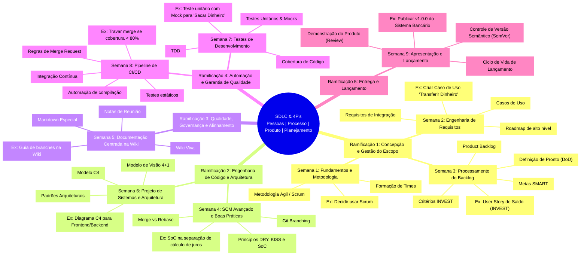
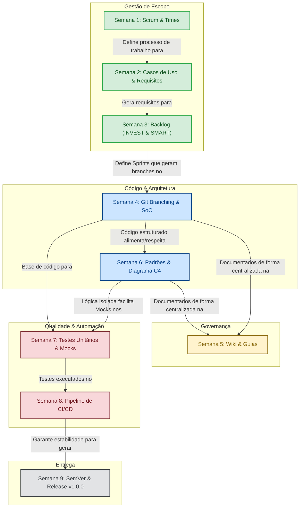

# Mapa Mental: Ciclo de Vida e Engenharia de Software Avançada (ISO124)

Este documento contém a representação visual dos conceitos da disciplina de Desenvolvimento de Software II (ISO124), estruturada em um Mapa Mental e um Diagrama de Fluxo das Conexões Diretas ("Efeito Dominó").

---

## 🗺️ Mapa Mental (Estrutura e Conteúdo)

O mapa mental abaixo organiza as semanas e ramificações propostas a partir do núcleo central do Ciclo de Vida de Software (SDLC) e dos 4P's.

---

## 🔗 O Efeito Dominó (Conexões e Dependências)

Como o mindmap representa uma árvore hierárquica pura, o fluxo abaixo demonstra o **Efeito Dominó** e a dependência direta entre as entregas de cada semana:

